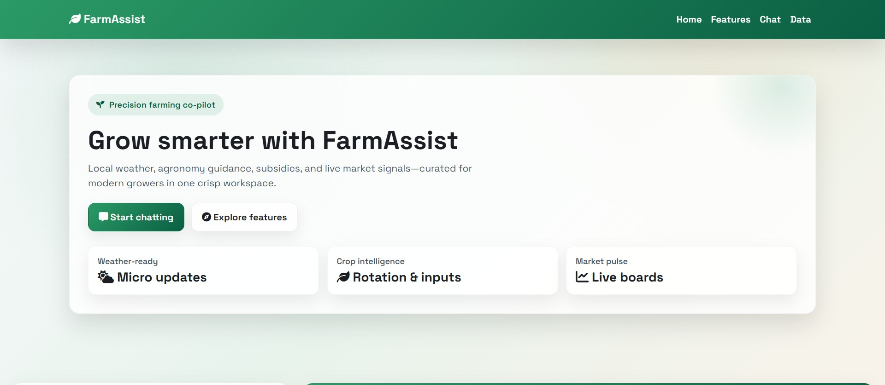
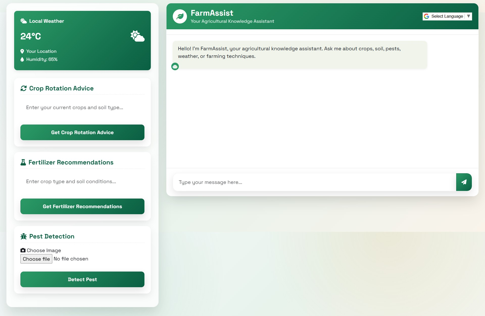
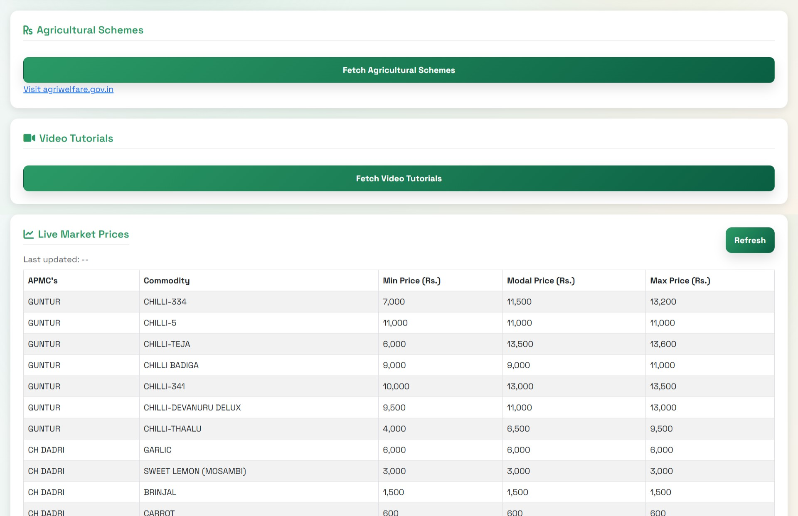

# Smart Agri Platform (Full-Stack) 🌾🤖


> **AgriTech Solution (2025):** A comprehensive full-stack platform designed to bridge the digital divide for farmers using accessible voice tools, multi-language support, and real-time market intelligence.

## 🖼️ Project Overview (Dashboard)
The main interface provides a comprehensive view of farm status and market data.


---

## 🌟 Advanced Features Showcase
This system goes beyond simple monitoring by integrating advanced accessibility and real-time data features.

### 🗣️ Accessibility & Live Data
* **Text-to-Speech (TTS):** Integrated Web Speech APIs read out crucial data for accessible usage in the field.
* **Multi-Language Support:** Dynamic language switching for broader regional accessibility.
* **Live Market API:** Real-time fetching and display of current crop prices.

**Feature Preview:**

*(Snapshot highlighting TTS controls and live price feeds)*

---

**Live-price Preview:**

*(Snapshot demonstrating Live-price)*

## 🏗️ Full-Stack Architecture
The system is built on a robust backend designed to handle data processing, API integrations, and serve the responsive frontend.

### 🛠️ Tech Stack
* **Frontend:** HTML5, CSS3 (Responsive Grid), JavaScript.
* **Backend:** (e.g., Python Flask / Node.js Express / Java Spring Boot - update this!)
* **APIs Integration:** Web Speech API (TTS), External Agriculture Market Data APIs.

## 🚀 How to Run Locally
```bash
# 1. Clone the repo
git clone [https://github.com/sumanthkatta-dev/smart-agri-platform-fullstack.git](https://github.com/sumanthkatta-dev/smart-agri-platform-fullstack.git)

# 2. Navigate into directory
cd smart-agri-platform-fullstack

# 3. Start the backend server
# (Add command specific to your backend here, e.g., 'python app.py' or 'npm run dev')
